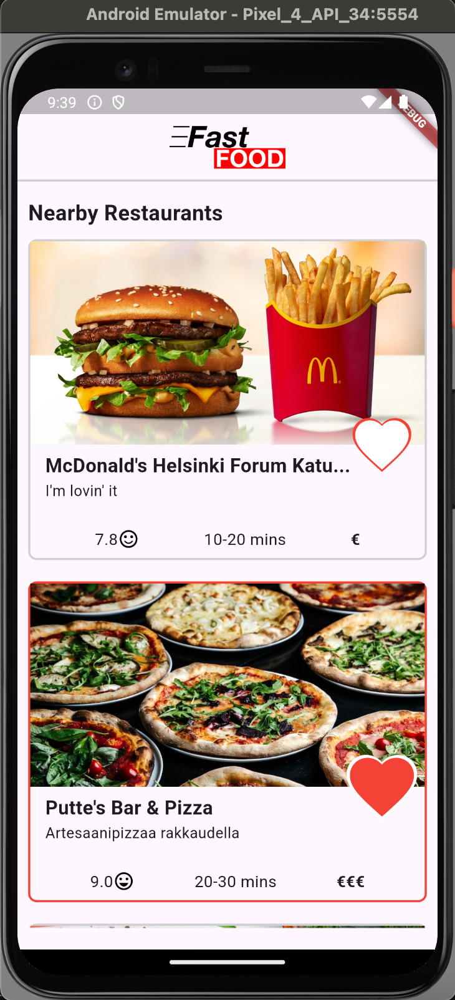
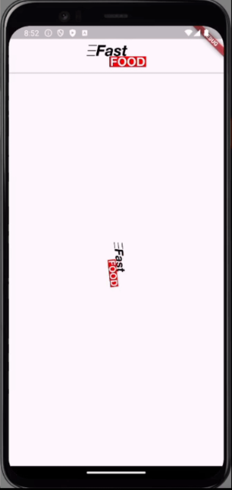

# Flutter-Ten-Day-App-Task

## About

As part of a recruitment process I was tasked with making a delivery app home screen. The app used real API data.

## Outcome

Screen shot showing the home screen and different items.

   

GIF showing the loader which was diplayed until the items were returned to the screen.

   

GIF showing the favourite animation.

   

GIF showing the fade-in animation of new items.
